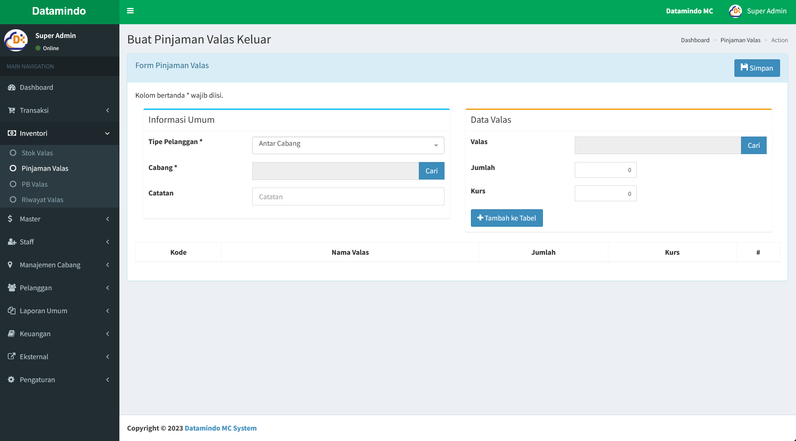

# Pinjaman Valas

Halaman **Pinjaman Valas** adalah bagian dari sistem aplikasi yang digunakan untuk mengelola data pinjaman valas, pengguna dapat memantau daftar pinjaman dan membuat pinjaman keluar baru.

---

## Struktur Halaman

### 1. **Judul Halaman**

- **Lokasi**: Bagian atas halaman.
- **Isi**: "Pinjaman Valas”.
- **Navigasi**: Breadcrumb di sebelah kanan atas menunjukkan posisi halaman saat ini, seperti “Dashboard > Pinjaman Valas”.

### 2. **Table Daftar Pinjaman Valas**

- **Fungsi**: Memberikan informasi tentang daftar pinjaman valas yang ada.

### 4. **Aksi dan Tombol**

- **Tombol "Pinjaman Keluar"**:
  - **Fungsi**: Digunakan untuk navigasi ke halaman form pinjaman valas.
  - **Lokasi**: Di bagian kanan atas halaman.

---

## Alur Penggunaan

1. **Membuat Pinjaman Keluar**:
   - Pengguna dapat menekan tombol "Pinjaman Keluar" di bagian kanan atas halaman, lalu akan diarahkan ke halaman form pinjaman valas seperti berikut :
     
   - Pengguna harus melengkapi form informasi umum dan data valas.
   - Periksa kembali data, apabila sudah sesuai maka pengguna dapat melakukan aksi simpan, dengan menekan tombol simpan di bagian kanan atas halaman.

## Lainnya

Baca juga tentang [cara mengelola transaksi valas](/transaksi/daftar-valas).
