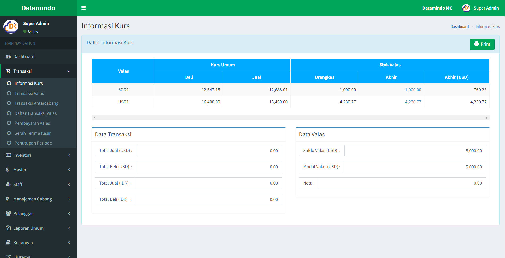

# Informasi Kurs

Halaman **Informasi Kurs** adalah bagian dari sistem aplikasi yang menampilkan data terkait nilai tukar mata uang (kurs), stok valuta asing, serta data transaksi yang relevan. Halaman ini dirancang untuk membantu pengguna dalam memantau data kurs valas dan transaksi keuangan.

---

## Struktur Halaman

### 1. **Judul Halaman**

- **Lokasi**: Bagian atas halaman.
- **Isi**: “Informasi Kurs”.
- **Navigasi**: Breadcrumb di sebelah kanan atas menunjukkan posisi halaman saat ini, seperti “Dashboard > Informasi Kurs”.

### 2. **Tabel Kurs Valas**

- **Fungsi**: Menampilkan nilai tukar mata uang asing dan stok yang tersedia.
- **Kolom**:
  - **Valas**: Menunjukkan jenis mata uang (contoh: SGD, USD).
  - **Kurs Umum**:
    - **Beli**: Nilai kurs saat pembelian mata uang asing.
    - **Jual**: Nilai kurs saat penjualan mata uang asing.
  - **Stok Valas**:
    - **Brankas**: Jumlah stok mata uang asing yang tersedia.
    - **Akhir**: Total stok mata uang asing pada akhir periode.
    - **Akhir (USD)**: Total stok dalam denominasi USD.

### 3. **Data Transaksi**

- **Fungsi**: Menampilkan total transaksi pembelian dan penjualan dalam dua mata uang (USD dan IDR).
- **Informasi yang Ditampilkan**:
  - **Total Jual (USD)**: Total nilai transaksi penjualan dalam USD.
  - **Total Beli (USD)**: Total nilai transaksi pembelian dalam USD.
  - **Total Jual (IDR)**: Total nilai transaksi penjualan dalam Rupiah.
  - **Total Beli (IDR)**: Total nilai transaksi pembelian dalam Rupiah.

### 4. **Data Valas**

- **Fungsi**: Menampilkan informasi terkait saldo dan modal valuta asing.
- **Informasi yang Ditampilkan**:
  - **Saldo Valas (USD)**: Jumlah saldo valuta asing dalam USD.
  - **Modal Valas (USD)**: Modal yang tersedia dalam USD.
  - **Nett**: Perhitungan akhir saldo dikurangi modal.

### 5. **Aksi dan Tombol**

- **Tombol "Print"**:
  - **Fungsi**: Digunakan untuk mencetak informasi yang ditampilkan pada halaman.
  - **Lokasi**: Di bagian kanan atas halaman.

---

## Alur Penggunaan

1. **Melihat Kurs Valas**:
   - Pengguna dapat melihat nilai kurs beli dan jual untuk setiap mata uang yang terdaftar.
2. **Memantau Transaksi Valas**:
   - Total transaksi penjualan dan pembelian ditampilkan dalam USD dan IDR.
   - Data ini memberikan gambaran keseluruhan terkait aktivitas keuangan yang dilakukan.
3. **Memantau Data Valas**:
   - Pengguna dapat memonitor saldo dan modal valuta asing serta melihat nilai “Nett” sebagai hasil dari saldo dikurangi modal.
4. **Mencetak Laporan**:
   - Klik tombol “Print” untuk mencetak laporan informasi kurs yang ditampilkan di halaman.

## Lainnya

Baca juga tentang [cara mengelola transaksi valas](/transaksi/daftar-transaksi).
