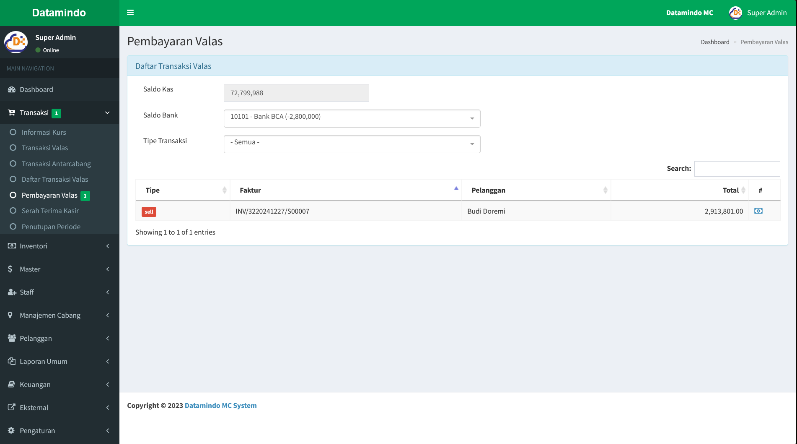

# Pembayaran Valas

Halaman **Pembayaran Valas** adalah bagian dari sistem aplikasi yang digunakan untuk mengelola data transaksi valas yang memerlukan pembayaran.

---

## Struktur Halaman

### 1. **Judul Halaman**

- **Lokasi**: Bagian atas halaman.
- **Isi**: "Pembayaran Valas”.
- **Navigasi**: Breadcrumb di sebelah kanan atas menunjukkan posisi halaman saat ini, seperti “Dashboard > Pembayaran Valas”.

### 2. **Informasi Saldo dan Tipe Transaksi**

- **Fungsi**: Memberikan informasi tentang saldo kas dan bank, dan filter data transaksi berdasarakan tipe transaksi.

### 3. **Tabel Data Transaksi**

- **Fungsi**: Menampilkan data transaksi.

### 4. **Aksi dan Tombol**

- **Tombol "Payment"**:
  - **Fungsi**: Digunakan untuk membuka form pembayaran.
  - **Lokasi**: Di bagian paling kanan di setiap baris data.

---

## Alur Penggunaan

1. **Melakukan pembayaran Valas**:
   - Pengguna dapat melakukan pembayaran valas dengan menekan tombol "Payment" pada transaksi yang ingin dilakukan pembayaran.
   - Form pembayaran akan muncul seperti pada gambar berikut :
     
   - Pilih metode pembayaran dan tekan tombol "Payment".
   - Pembayaran telah selesai, dan status transaksi akan berubah dari unpaid ke paid.

## Lainnya

Baca juga tentang [cara mengelola transaksi valas](/transaksi/daftar-valas).
